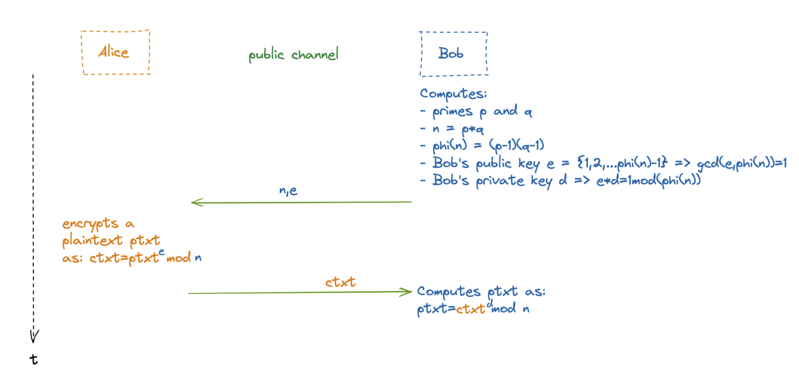
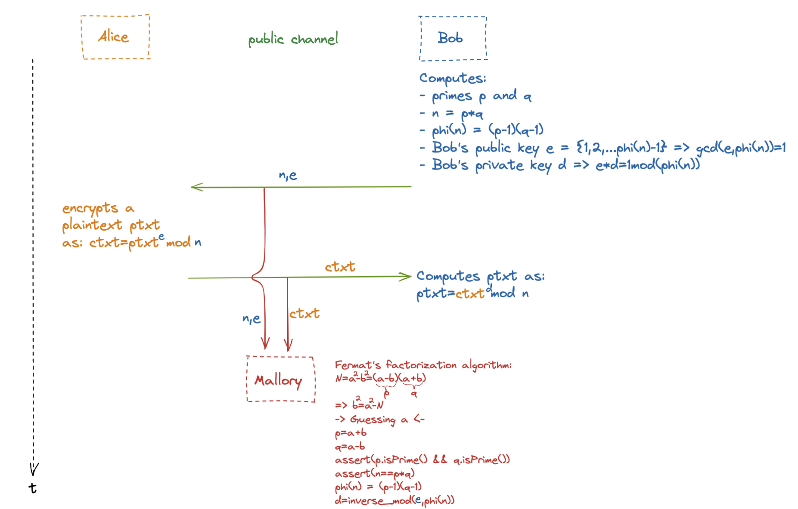

# Breaking RSA cryptosystem

or, how easy it is to fail in cryptography 

## **Key generation**

The keys for the RSA algorithm are generated in the following way:

1. Choose two distinct prime numbers *p* and *q*
    - For security purposes, the integers *p* and *q* should be chosen at random
    - *p* and *q* are kept secret
2. Compute *n* = *pq*
    - *n* is used as the modulus for both the public and private keys. Its length, usually expressed in bits, is the key length.
    - *n* is released as part of the public key
3. Compute Φ(*n*)=(p-1)(q+1)
    - Φ(*n*) is kept secret
    - Φ(*n)* counts the positive integers up to a given integer *n* that are relatively prime - Euler’s Phi function
4. Choose an integer *e* such that 1 < *e* < Φ(*n*) and gcd(*e*, Φ(*n*)) = 1
    - *e* having a short bit-length and small Hamming weight results in more efficient encryption – the most commonly chosen value for *e* is 2 + 1 = 65537
    - *e* is released as part of the public key
5. Determine *d* as *d* ≡ *e* (mod Φ(*n*)); that is, *d* is the modular multiplicative inverse of *e* modulo Φ(*n*)
    - This means: solve for *d* the equation *d*⋅*e* ≡ 1 (mod Φ(*n*)); *d* can be computed efficiently by using the extended Euclidean algorithm
    - *d* is kept secret as the *private key exponent*.
6. Safely get rid of prime numbers p and q, as well as Φ(*n*)
7. Share the e (public key) and n via public channel freely

## Security of RSA

The security of RSA relies on the practical difficulty of factoring the product of two large prime numbers, the "factoring problem". Breaking RSA encryption is known as the RSA problem.

There are no published methods to defeat the system if a large enough key is used.

In cryptography, the **RSA problem** summarizes the task of performing an RSA private-key operation given only the public key. The RSA algorithm raises a *message* to an *exponent* , modulo a composite number *N* whose factors are not known. Thus, the task can be neatly described as finding the *e*th roots of an arbitrary number, modulo N. For large RSA key sizes (in excess of 1024 bits), no efficient method for solving this problem is known

## Taking it upon ourselves

Since key generation in RSA doesn’t take much math knowledge or complicated algorithm, let’s try generating a safe pair of public and private key ourselves in Python and we’ll also use all kinds of libs to ensure everything is safe 

### Scenario (we are Bob in this scenario)



1. Choose two distinct prime numbers *p* and *q*

Since we want them to be very large and random, let’s let Python do it’s thing and for start, let’s pick a random number with around 1024 bits and then choose p as the prime number that comes next up from that random number and q as the first prime number that comes up previous to that random number

```python
import random
from sympy import *
rand = random.getrandbits(1024)
p = nextprime(rand)
q = prevprime(rand)
```

```julia

Huuge RANDOM number that will help us choose p and q as the next and previous prime numbers:

30472792467791860807142757737652747219438510034665052586765033166091274072973130176475052462068313370988591049942559064311283922639857905443315592135403594110636345632637362657211655796184896901865111939640975096623975171643124347846868603435149746092329842044224599248754459547050021134760900677665304465614

Number of bits of randomly generated number: 1022
----------------------------------------------------------------------------------------------------------------
p (next prime number):

30472792467791860807142757737652747219438510034665052586765033166091274072973130176475052462068313370988591049942559064311283922639857905443315592135403594110636345632637362657211655796184896901865111939640975096623975171643124347846868603435149746092329842044224599248754459547050021134760900677665304466697

Number of bits of prime number p: 1022
----------------------------------------------------------------------------------------------------------------
q (previous prime number):

30472792467791860807142757737652747219438510034665052586765033166091274072973130176475052462068313370988591049942559064311283922639857905443315592135403594110636345632637362657211655796184896901865111939640975096623975171643124347846868603435149746092329842044224599248754459547050021134760900677665304464237

Number of bits of prime number q: 1022
```

So, prime numbers p and q are both

- random ✔️
- large ✔️
2. Compute *n* = *pq*

```julia
Calculating n (public after calc) as p*q:

928591080785112366167251779100989975224428826277653146555305913296334921468221470682907557737546443362385022680387088419278348591935173645551723321050876408929592076578329349240312055327972205166587533915101725036743850796114020810339176302594872305182914741581918380322322802480515895075683860138222547300262030121642312059850208766444366679376799752166432997446139306412935485446796124684578134092910542748598108162628371646749350414057997210795627431480765933134988417898691466876466126605780701060799603715513627608894633799285182489038402013919615713831333217455345772993963771805365924968556874088330594015189

Number of bits of n: 2043
```

n is very big, impossible to do factorization from computational security standpoint ✔️

3. Compute Φ(*n*)=(p-1)(q+1)

```julia
Calculating phi(n) (must stay super secret) as (p-1)*(q-1):

928591080785112366167251779100989975224428826277653146555305913296334921468221470682907557737546443362385022680387088419278348591935173645551723321050876408929592076578329349240312055327972205166587533915101725036743850796114020810339176302594872305182914741581918380322322802480515895075683860138222547300201084536706728338235923250969061184937922732097102892272609240080752937300849864331628029168773916006620926062743253518126782568778281399908996247209958744913715726633416741562042815013410907257069379836231677415646683455998933793344664807049316221646673533366896574496454852711265882699035072732999985084256

Number of bits of phi(n): 2043
```

4. Choose an integer *e* such that 1 < *e* < Φ(*n*) and gcd(*e*, Φ(*n*)) = 1

```python
e = 65537
```

5. Determine *d* as *d* ≡ *e* (mod Φ(*n*)); that is, *d* is the modular multiplicative inverse of *e* modulo Φ(*n*)

```python

def extendedEuclidianAlgorithm(a, b):
    if a == 0 : 
        return b, 0, 1            
    gcd, x1, y1 = extendedEuclidianAlgorithm(b%a, a)
    s = y1 - (b//a) * x1
    t = x1
    return gcd, s, t

EEA = extendedEuclidianAlgorithm(phi,e)
# Assert that gcd is 1
assert(EEA[0]==1)
# EEA -> EEA(n,a) => t in linear combination is a^(-1)
d = abs(EEA[2])
```

```julia
d (private key): 138558252269673830488877353980630498309652402340192107056538085754991214078119806549096739355104241415395320762187853237898026624357753072002842704984306886231021879501037317945908594977680397246197712653245949145281567922474312365599688802708016178225791892487138255354562990149945297129028067630371824924068334004981233447054474471996375319705020772955392666486623521960872224451302482922608457775629646224708882554397764257652346105865126780440210481124649992622659354116730737075777296611321013504842782938164846932993712216247517792470169173873312225635638196481298832750977798871835284906447716194760316373025

Number of bits of private key d: 2041
```

6. Safely get rid of prime numbers p and q, as well as Φ(*n*)
7. Share the e (public key) and n via public channel freely

## Conclusion

Considering how carefully we chose our random huge numbers, safely got rid of them after calculations, how surprised would you be that it took an attacker 1 iteration! of a loop of some sort to get our private key and decrypt any message encrypted with our public key. 🤯

### But how?

The answer lays in the fact that our prime numbers, even though big in size and chosen at random, are numbers that are quite close together which makes it easy to do factorization of n using **Fermat’s Factorization method**



Fermat’s Factorization method is based on the representation of an odd integer as the difference of two squares. For an integer **n**, we want **a** and **b** such as:

$$
n=a^2-b^2=(a+b)(a-b)
$$

where (a+b) and (a-b) are the factors of the number n. And since we chose n as n=p*q, (a+b) and (a-b) represent exactly those two prime numbers

From the formula above, it’s visible that:

$$
b^2=a^2-n
$$

Therefore, we must find a for which a^2-n gives a power of 2.

### What’s a good guess for a?

a is roughly sqrt(n) for a start, then move up (increment) until a^2-n results in a number that is a power of 2 (2^x)

### Final remarks

The mistake that we (Bob) did was choosing prime numbers p and q that are close to each other (or equally bad, p==q). In practice, preferably, p and q are not even the same number of bits. For example, they can be chosen as picking a random number and then find the next prime up for p and then pick another random number and make q be the next prime up from it